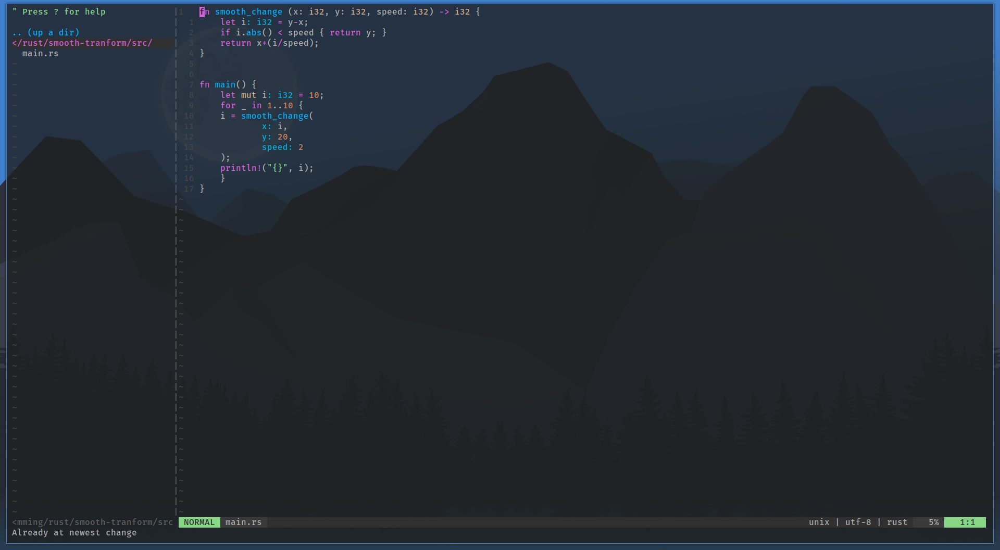

# Sample Image


# How to use
Install Alacritty, Vim, Nodejs, fzf and The Silver Searcher
```sh
pacman -S alacritty vim nodejs fzf the_silver_searcher
```
Install the config
```sh
chmod +x install.sh
./install.sh
```
# Vim Language Server
If you want autocompletion see

https://github.com/neoclide/coc.nvim/wiki/Using-coc-extensions#implemented-coc-extensions
